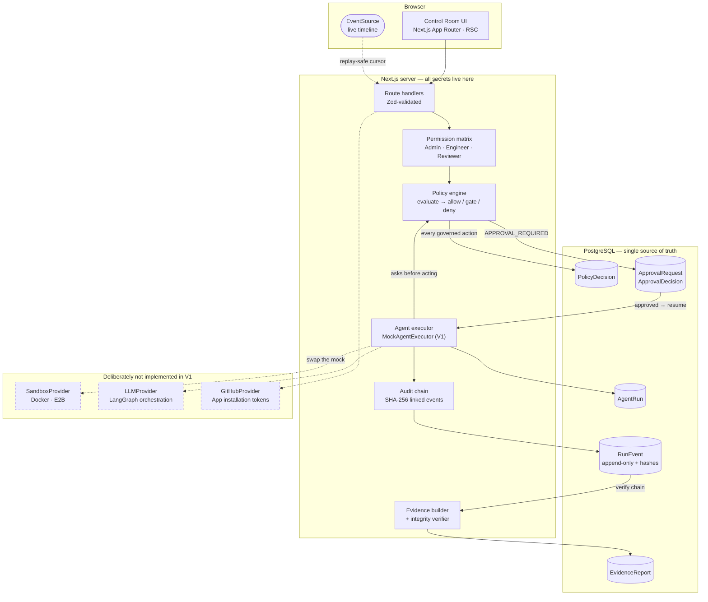
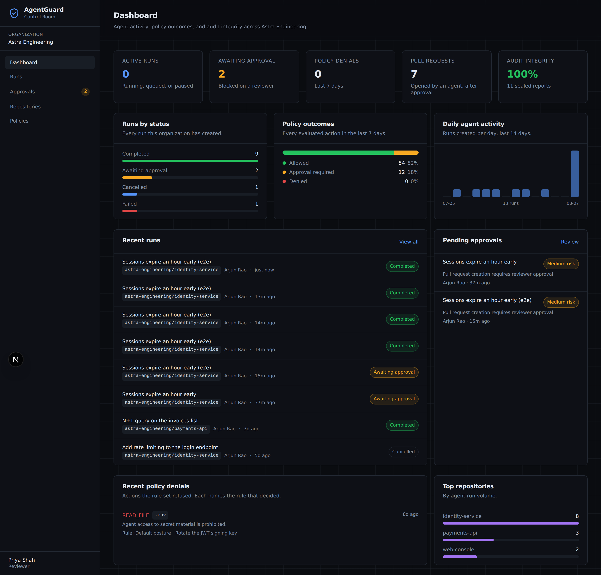
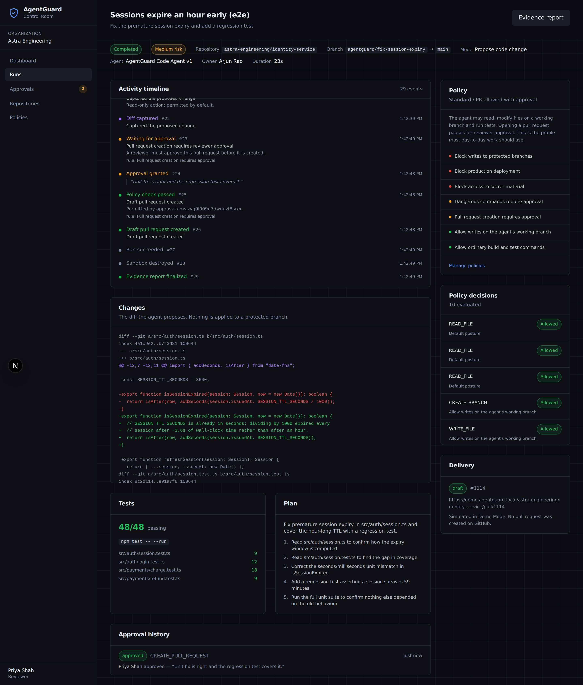
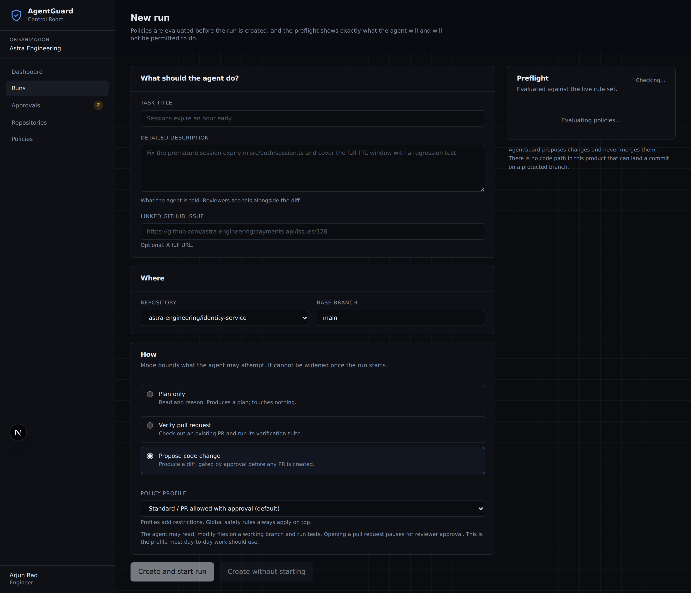
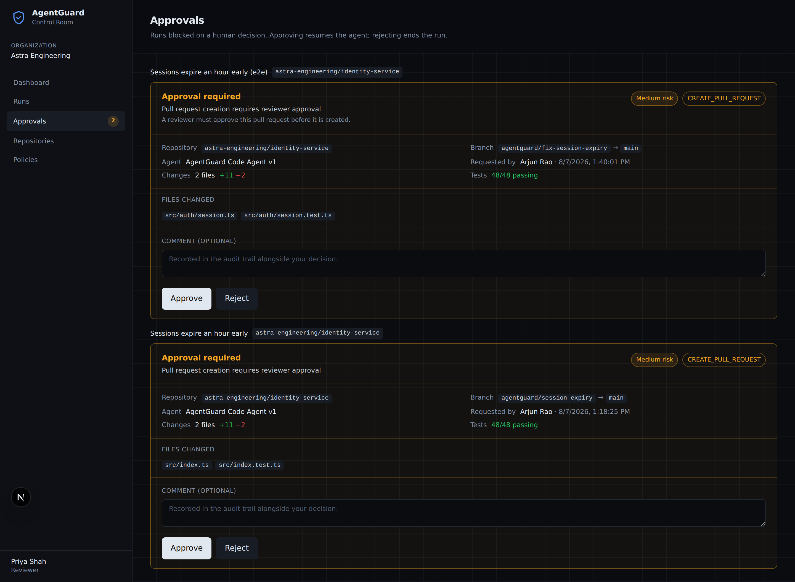
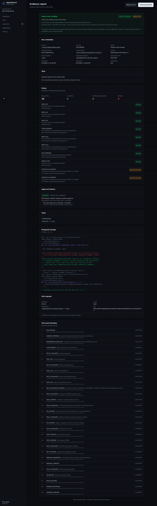
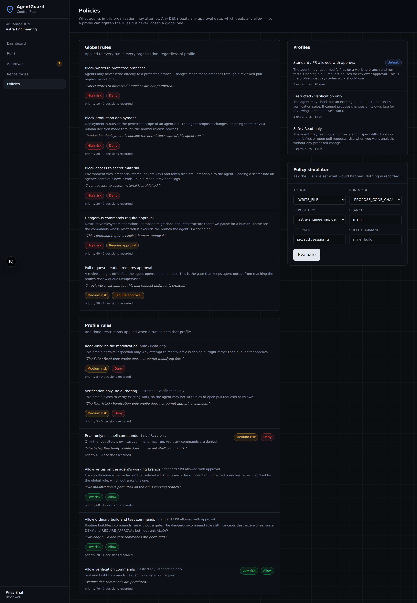

# AgentGuard Control Room

[](https://github.com/MEGA-M1ND/Vuln-Dev-Room/actions/workflows/ci.yml)

**A governance and shared-visibility control plane for AI coding agents.**

Submit agent work against a repository, watch it execute under explicit policy,
approve it before anything is delivered, and keep a tamper-evident record of
what happened.

Built for small engineering teams (3–10 people) with a GitHub-native workflow.

> **On the repository name.** The GitHub slug is still `Vuln-Dev-Room`, a
> vestige of an earlier working title. There is no vulnerability-scanning
> functionality here. Renaming is a settings change the owner must make;
> nothing in the code depends on the slug.

---

## The problem

Engineering teams are adopting coding agents fast, and almost all of that work
happens invisibly inside one developer's terminal. That produces four concrete
problems, none of which are solved by the agent getting smarter:

| Problem | What it looks like in practice |
| --- | --- |
| **Invisible** | Nobody but the operator knows what the agent read, changed, or ran. |
| **Ungoverned** | Nothing structurally prevents an agent reading `.env`, force-pushing, or running a migration. "Be careful" is a prompt, not a control. |
| **Unreviewable** | The diff arrives with no record of how it was reached, so review starts from zero. |
| **Unauditable** | When something goes wrong, there is no trustworthy account of what the agent actually did. |

AgentGuard is the control plane around the agent, not another agent. It makes
the work visible while it happens, applies policy *before* each action rather
than after, requires a second human before anything is delivered, and produces
an evidence bundle whose integrity can be checked.

### What this is not

- Not a Devin clone, and not an agent itself
- Not a Jira replacement
- **Not an autonomous merge-to-main system** — there is no merge call anywhere
  in the codebase, and no UI or API path that could reach one
- Not a multi-agent swarm dashboard
- Not a productivity-surveillance tool

---

## Architecture



**The load-bearing arrow is `EXEC → POL`.** The policy check sits between the
agent's intent and the action, not inside the agent's prompt. A prompt is a
request; a policy is a control.

---

## Features

### Governed execution
- Three run modes — **Plan only**, **Verify pull request**, **Propose code
  change** — each an outer bound on what the agent may attempt, fixed at
  creation and not widenable mid-run
- **Preflight panel** that runs the real rule set before the run is created and
  states plainly what is allowed, what will pause, and what is refused
- Policy evaluated before every governed action, with the decision persisted
  whether it was allowed or not

### Human control
- **Approval gate** enforced in the executor and the database, not just the UI
- **Self-approval is refused** — a requester cannot approve their own run, even
  as an Admin
- Pause, resume, and cancel a live run
- A rejected gate ends the run; the agent does not get a second route to the
  same action

### Visibility
- Live event timeline over Server-Sent Events, with colour-coded event families
  (policy checks, tool calls, tests, approvals, delivery)
- Dashboard with run status, policy outcomes, daily activity, and audit
  integrity rate
- Policy simulator that calls the same evaluation code the executor does

### Accountability
- **Tamper-evident audit chain**: every event hashed against its predecessor
- **Evidence report** with metadata, policy decisions, tool calls, diff, tests,
  approval history, and a live integrity verdict
- JSON download and a print-friendly view for incident reviews and audit packets
- `scripts/verify-chains.ts` for out-of-band verification

---

## Quick start

**Prerequisites:** Node 20+, Docker (or a local PostgreSQL 16).

```bash
git clone https://github.com/MEGA-M1ND/Vuln-Dev-Room.git
cd Vuln-Dev-Room
npm install

cp .env.example .env
# Set AUTH_SECRET to any long random string:
#   openssl rand -base64 32

docker compose up -d          # PostgreSQL on 127.0.0.1:5432
npm run db:deploy             # apply migrations
npm run db:seed               # Astra Engineering demo data

npm run dev                   # http://localhost:3000
```

Sign in as any of the seeded users. **Approval requires two different people**,
so you will need at least two of them:

| Email | Role | Can do |
| --- | --- | --- |
| `maya.chen@astra.dev` | Admin | Everything, including managing policies |
| `arjun.rao@astra.dev` | Engineer | Create, steer, pause, and cancel runs |
| `priya.shah@astra.dev` | Reviewer | Resolve approval gates; cannot author work |

---

## Demo script

Five minutes, no GitHub credentials required.

1. **Sign in as Arjun Rao** (Engineer). The dashboard shows seeded history:
   runs by status, policy outcomes, and pending approvals.
2. **Runs → New run.** Pick `astra-engineering/payments-api`, title it
   *"Refund endpoint is not idempotent"*, leave the mode on **Propose code
   change**.
   *Watch the preflight panel on the right.* Before anything runs it already
   says: reading and testing are allowed, opening a pull request will require
   approval, and reading secrets or deploying to production is denied outright.
3. **Create and start run.** The control room opens and the timeline streams
   live: sandbox prepared → plan → policy checks → file reads → edits → tests
   pass 48/48 → diff captured.
4. **The run stops at the gate.** Status becomes *Awaiting approval*. No pull
   request exists. Try to approve it — you cannot: *"You started this run.
   Approval requires a second person."*
5. **Sign in as Priya Shah** (Reviewer) and open **Approvals**. The review card
   shows the repository, branches, files changed, diff stat, test results, and
   the rule that forced the gate. Approve with a comment.
6. **The run resumes** and delivers a draft pull request (simulated in Demo
   Mode).
7. **Open the Evidence report.** *Audit trail verified*, the chain head hash,
   every policy decision, the full timeline, and Priya's comment on the record.
   Download the JSON.
8. **Optional — prove the chain works.** Edit one event's payload directly in
   Postgres, reload the report, and it turns into *Integrity check failed*
   naming the exact event.

Try `npx tsx scripts/verify-chains.ts` at any point to verify every run's chain
from the command line.

---

## Environment variables

Only two are required. Everything else degrades to a clearly-labelled
"not configured" state rather than failing.

| Variable | Required | Purpose |
| --- | --- | --- |
| `DATABASE_URL` | **yes** | PostgreSQL connection string |
| `AUTH_SECRET` | **yes** | Session signing key |
| `DIRECT_URL` | no | Direct connection for migrations behind a pooler |
| `NEXT_PUBLIC_APP_URL` | no | Absolute links in evidence reports |
| `DEV_AUTH_ENABLED` | no | Development user switcher. **Ignored when `NODE_ENV=production`** |
| `AUTH_GITHUB_ID` / `AUTH_GITHUB_SECRET` | no | GitHub OAuth sign-in |
| `DEVROOM_GITHUB_ENABLED` | no | Turns on real GitHub delivery |
| `GITHUB_TOKEN` | no | Server-side only; never sent to the browser |
| `GITHUB_APP_ID` / `GITHUB_APP_PRIVATE_KEY` / `GITHUB_WEBHOOK_SECRET` | no | GitHub App flow (roadmap — see below) |
| `LIVEBLOCKS_SECRET_KEY` | no | Multiplayer presence |
| `DEVROOM_INGEST_TOKEN` | no | External agent adapters posting to `/api/agent-events` |
| `DEVROOM_DEMO_MODE` | no | Extra demo affordances |

See [`.env.example`](.env.example) — a test enforces that every variable the
code reads is documented there.

### Demo Mode

When no GitHub credentials are configured the app runs in **Demo Mode**, which
is labelled in the sidebar and on the Repositories page. In Demo Mode:

- repositories come from the seed rather than the GitHub API
- agent execution is simulated by `MockAgentExecutor`
- an approved pull request is recorded as a `SIMULATED` link with a
  non-resolving `demo.agentguard.local` URL, deliberately not a `github.com`
  one that might point at somebody's real PR

**Everything else is real.** Policies are evaluated by the live rule set,
approval gates block in the database, and the audit trail is hash-chained
exactly as it would be against a real repository. The simulated part is the
agent, not the control plane.

---

## Security model

| Control | How it is enforced |
| --- | --- |
| **No merge capability** | `GitHubProvider` has no merge method. There is no route, service, or UI control that can land a change on a default branch. |
| **Secrets stay server-side** | No `NEXT_PUBLIC_` variable holds a credential. The repositories endpoint returns no token, installation id, or clone URL. |
| **Secret files unreadable** | A global DENY policy blocks `.env*`, `*.pem`, `*.key`, `**/secrets/**`, `**/.aws/**`, `*.tfstate` and more. |
| **Default-deny for mutations** | An action no rule matches is denied if it changes state, allowed only if it is read-only. |
| **Separation of duty** | `approval:decide` is held by Admin and Reviewer only, and the service refuses self-approval regardless of role. |
| **Authorization at the service** | Every route resolves the caller's real role from Postgres. Hiding a button is a courtesy; the refusal is the control. |
| **No arbitrary execution** | V1 executes no shell commands at all. Commands are simulated. |
| **No token logging** | Tokens are never logged, and the rate limiter keys on a fingerprint rather than the token. |
| **Non-members get 404** | A run or organization the caller cannot see reads as "not found", never "forbidden", which would confirm it exists. |

### The default-deny asymmetry

The single most important line in the policy engine:

```ts
const DEFAULT_ALLOWED_ACTIONS = new Set(["READ_FILE", "RUN_TESTS", "INSPECT_DIFF"]);
```

Anything else that no rule matches is **denied**. A governance tool whose
unmatched default is "allow" grants every capability nobody thought to write a
rule about — including capabilities added to the product after the rules were
written.

---

## Policy engine

A policy is a small declarative record, not code:

```ts
{
  name: "Block access to secret material",
  effect: "DENY",                      // ALLOW | REQUIRE_APPROVAL | DENY
  riskLevel: "HIGH",
  priority: 30,
  message: "Agent access to secret material is prohibited.",
  condition: {
    actions: ["READ_FILE", "WRITE_FILE", "READ_SECRET"],
    pathPatterns: [".env", ".env.*", "*.pem", "**/secrets/**", "*.tfstate"],
  },
}
```

The condition language is a **closed matcher shape** — lists and restricted
globs — rather than an expression language. A policy engine that evaluates
arbitrary expressions is an arbitrary code execution engine, which is exactly
what this product exists to fence in. Globs compile with every regex
metacharacter escaped, so a rule reading `.env*` cannot smuggle in a regex.

### Precedence is by effect, not by order

```
any DENY  >  any REQUIRE_APPROVAL  >  any ALLOW  >  default posture
```

Rule `priority` only breaks ties *within* the same effect. With
first-match-wins, adding one broad ALLOW at the top of the list would silently
disable every prohibition beneath it — the footgun that makes real policy
systems dangerous. Because DENY always wins, a profile can only ever tighten
the global rules, never loosen them.

### Built-in rules

| Rule | Effect |
| --- | --- |
| Block writes to protected branches (`main`, `master`, `production`, `release/*`) | DENY |
| Block production deployment | DENY |
| Block access to secret material | DENY |
| Dangerous commands (`rm -rf`, `drop table`, `terraform destroy`, force-push…) | REQUIRE_APPROVAL |
| Pull request creation | REQUIRE_APPROVAL |

### Profiles

| Profile | Adds |
| --- | --- |
| **Safe / Read-only** | Denies all writes and all shell commands |
| **Standard** (default) | Allows working-branch writes and ordinary build/test commands |
| **Restricted / Verification only** | Denies authoring; allows verification commands |

Test them yourself in **Policies → Policy simulator**, which calls the same
`evaluateAction` the executor uses. A simulator that reimplements the decision
procedure would eventually disagree with the engine, and the one time it
matters is the time someone trusted it.

---

## Audit hash chain

Every run owns an ordered chain of events:

```
eventHash = SHA-256( previousHash + "\n" + canonical(event) )
```

- `previousHash` is a fixed genesis constant for the first event, and the
  prior event's hash thereafter
- `canonical(event)` is JSON with **recursively sorted keys**, so two
  structurally identical payloads built in different orders hash identically —
  without this, key ordering would produce false tampering reports
- `createdAt` is set in application code, not by the database default, because
  it is part of the hashed payload and the verifier must reproduce it exactly

Editing, deleting, or reordering any event breaks verification for that event
and everything after it. `verifyChain` reports the exact sequence number.

### What this is and is not

It is a **tamper-evident, append-only log**. It is **not a blockchain** and we
do not claim it is one.

What it genuinely buys: any modification made *through the application* — a
stray UPDATE from a route handler, a bug that rewrites history, an operator
patching one row — is detected, because nothing in the app ever recomputes
downstream hashes.

What it does not buy: defence against an attacker with direct database write
access who recomputes the entire chain. Anchoring the chain head to an
append-only external store closes that gap; it is listed under Future work.

Events written before hashing existed report as **unchained** rather than as
tampering. "We never hashed this" and "someone edited this" are different
claims, and conflating them would make the verified badge meaningless.

---

## Screenshots

| | |
| --- | --- |
|  |  |
| **Dashboard** — metrics, policy outcomes, activity | **Control room** — live timeline, policy panel, diff |
|  |  |
| **Preflight** — what the agent may and may not do | **Approvals** — the reviewer's queue |
|  |  |
| **Evidence report** — verified chain, full record | **Policies** — rule set and simulator |

---

## API

All routes are Zod-validated and return a consistent error envelope
(`{ error: { code, message, details } }`).

| Method | Route | Purpose |
| --- | --- | --- |
| `GET` | `/api/runs?roomId=` | List runs (paginated) |
| `POST` | `/api/runs` | Create a governed run |
| `POST` | `/api/runs/preflight` | Evaluate a prospective run |
| `GET` | `/api/runs/:id` | Run detail |
| `POST` | `/api/runs/:id/simulate` | Start the mock executor |
| `POST` | `/api/runs/:id/pause` · `/resume` · `/cancel` | Lifecycle control |
| `GET` | `/api/runs/:id/events` | Timeline (snapshot) |
| `GET` | `/api/runs/:id/events/stream` | Timeline (SSE) |
| `GET` | `/api/runs/:id/approval-requests` | Gates and their history |
| `POST` | `/api/approval-requests/:id/approve` · `/reject` | Resolve a gate |
| `GET` | `/api/runs/:id/evidence` | Evidence bundle (live + sealed) |
| `GET` | `/api/runs/:id/evidence/download` | Bundle as a JSON attachment |
| `GET` | `/api/policies?roomId=` | Active rule set |
| `POST` | `/api/policies/evaluate` | Policy simulator |
| `GET` | `/api/github/repositories?roomId=` | Enabled repositories |

There is deliberately **no** endpoint to create an approval request: gates are
opened by the executor when policy demands one, never by a client. A gate a
caller can create is a gate a caller can decline to create.

---

## Testing

```bash
npm run typecheck
npm run lint
npm test                # 259 unit + integration tests
npm run build

# End-to-end, against a running seeded app:
npm run db:seed && npm run dev
E2E_NO_SERVER=1 E2E_BASE_URL=http://localhost:3000 npx playwright test
```

Integration and e2e tests need PostgreSQL; integration tests skip themselves
cleanly when `DATABASE_URL` is unset.

Coverage of the properties that matter:

- **Policy evaluation** — 48 unit tests: each built-in rule, effect precedence,
  glob escaping, default posture, mode bounds, profile composition
- **Audit chain** — 23 unit tests: canonicalization, and detection of modified,
  deleted, reordered, inserted, and re-hashed-with-stale-parent events
- **Approval gate** — integration tests for gating, self-approval refusal,
  rejection ending the run, double-resolution refusal, and tamper detection on
  a persisted event
- **End-to-end** — the whole demo flow through the real UI, including that the
  requester is refused their own approval and that the downloaded bundle
  verifies

---

## Repository layout

```
src/
  app/
    (control-room)/          dashboard · runs · approvals · repositories · policies · evidence
    api/                     route handlers
  components/agentguard/     control-room UI
  lib/
    agents/                  AgentExecutor, MockAgentExecutor, providers, approvals
    audit/                   hash chain + verifier
    policy-engine/           condition matching, evaluation, built-in rules
    evidence/                bundle builder
    dashboard/               metrics
prisma/                      schema, migrations, seed
scripts/verify-chains.ts     out-of-band integrity check
tests/                       unit · integration · e2e
services/agent-runtime/      Python LangGraph runtime (earlier foundation)
```

Domain logic stays out of React components: pages read from services in `lib/`.

---

## GitHub App integration roadmap

V1 talks to GitHub with a personal access token, which is fine for one operator
and wrong for a team: a PAT carries one person's full account access and does
not expire.

1. **Register the App** with read access to code, issues, and pull requests,
   plus write access to pull requests. **Do not request merge or admin scopes** —
   the absence is the product's core claim.
2. **Installation token exchange** — sign an App JWT with the private key
   server-side, trade it for a per-installation token that expires in an hour.
   The private key must never reach a browser.
3. **Implement `GitHubProvider`** (`src/lib/agents/providers.ts`). The interface
   is already the shape the control plane calls; only the implementation is
   missing. Note it still has no merge method.
4. **Webhooks** at `/api/github/webhooks`, signature-verified with
   `GITHUB_WEBHOOK_SECRET`, to keep PR state fresh.
5. **Real PR creation behind explicit confirmation**, gated by the same
   approval that gates the simulated one.

---

## Future work

**Replace the mock executor.** `SandboxProvider` and `LLMProvider` are already
the seams. A real worker needs a per-run filesystem destroyed on completion, no
network egress during the agent phase, runtime-enforced resource limits, and no
ambient credentials in the sandbox. The Python LangGraph runtime in
`services/agent-runtime/` is the starting point.

**Durable job queue.** The V1 driver is a detached async loop in the Next.js
process — fine for a long-lived server, wrong for serverless. Run progress
already lives in the database and `resumeStalledRun` recovers stranded runs, so
the change is contained to `src/lib/agents/driver.ts`.

**External anchoring for the audit chain.** Periodically publishing the chain
head to an append-only external store closes the direct-database-write gap
described above.

**Policy authoring UI.** Rules are seeded and readable today; creating and
editing them in-app needs a form that cannot express an invalid condition.

**Multi-organization routing.** The data model already supports it; the UI
assumes one organization per user.

**Richer diff review** — inline comments on agent-proposed changes, and
per-file approval rather than whole-run approval.

---

## Related documentation

- [`docs/agent-dev-room-foundations.md`](docs/agent-dev-room-foundations.md) —
  the multiplayer run/room foundations this control plane is layered on
- [`docs/agent-event-contract.md`](docs/agent-event-contract.md) — ingestion
  contract for external agent adapters
- [`adapters/claude-code/`](adapters/claude-code/) — a working adapter that
  publishes a Claude Code session into a room
