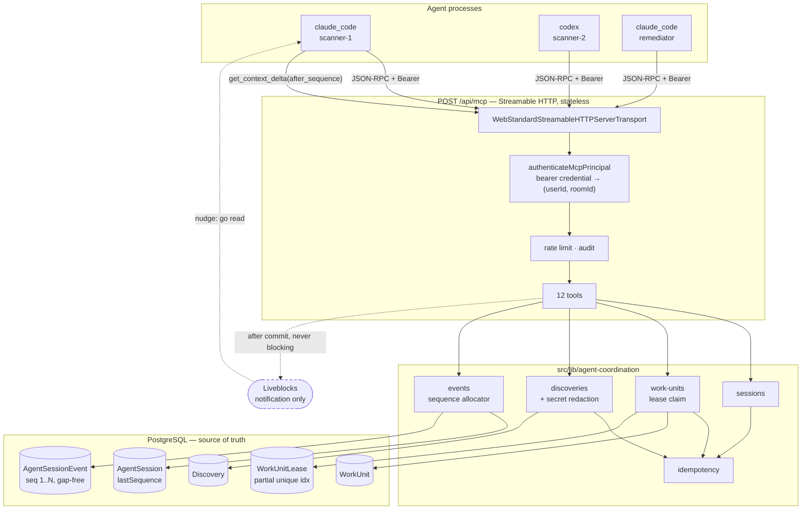

# Multi-agent coordination — architecture and threat model

Phase 1 of a governed shared-memory and work-coordination layer for several
coding/security agents working one repository at the same time.

**What this phase does:** coordinates *memory and work claims*.
**What it does not do:** intercept filesystem writes. See §7.

---

## 1. The problem

Several agents sweep one repository in parallel. Without a coordination layer
they duplicate each other's work, both "fix" the same file, and report findings
that nobody can weigh because nothing records who claimed what, on what
evidence, at what confidence.

Three questions have to have a single authoritative answer:

1. **Who is in this session?** — `AgentSession`, `AgentSessionMember`
2. **Who holds which piece of work right now?** — `WorkUnit`, `WorkUnitLease`
3. **What has been claimed to be true, by whom?** — `Discovery`, `DiscoveryEvidence`

PostgreSQL answers all three. Liveblocks only says "something changed, go look".

---

## 2. Shape



**The load-bearing detail is the partial unique index on `WorkUnitLease`.**
Everything else is bookkeeping around "exactly one agent holds this unit".

---

## 3. The three concurrency mechanisms

Three different problems, three different Postgres primitives. No
application-level read-then-write decides anything.

### 3.1 Sequence allocation — a locking UPDATE

```sql
UPDATE "AgentSession" SET "lastSequence" = "lastSequence" + 1
 WHERE id = $1 RETURNING "lastSequence";
```

Run inside the same transaction as the event insert. The UPDATE takes a row
lock, so concurrent appenders serialize on the session row and each gets a
distinct consecutive value — **gap-free**, not merely unique.

Gap-free matters because `get_context_delta` paginates on this number. A hole
in the sequence is indistinguishable, to a polling client, from an event it
missed. This is deliberately stronger than the older `RunEvent` pattern in
`src/lib/agent/ingest.ts` (read `MAX(sequence)`, insert, retry on conflict),
which is correct but leaves holes under contention.

### 3.2 Lease claiming — a partial unique index

```sql
CREATE UNIQUE INDEX "WorkUnitLease_active_per_unit"
  ON "WorkUnitLease" ("workUnitId") WHERE "releasedAt" IS NULL;
```

Concurrent claimants all attempt the INSERT; Postgres admits exactly one. The
losers get `P2002`, which the service reports as `already_claimed` — losing a
race is a normal outcome for a coordinating agent, not a fault.

**A note on what did not work.** The first implementation gated the claim on a
conditional UPDATE of `WorkUnit` with a `NOT EXISTS (SELECT … FROM
"WorkUnitLease" …)` guard. That is the obvious formulation and it is wrong
here: under READ COMMITTED, when a blocked UPDATE unblocks it re-evaluates its
predicate against the *updated target row*, but the subquery over the other
table still uses the statement's original snapshot. Two claimants could both
observe "no active lease" and both proceed. The index caught it on the
six-way concurrent test in `tests/integration/coordination-concurrency.test.ts`.
Making the index the sole arbiter removes the subtlety rather than working
around it.

### 3.3 Idempotency — a unique constraint, committed with the effect

`IdempotencyRecord` is written **inside** the same transaction as the effect it
describes. The guarantee: *the stored response and the effect commit together,
or neither does*. A record written outside the transaction could outlive an
effect that rolled back, and every later replay would then return success for
work that never happened — worse than no idempotency at all.

Two simultaneous first attempts both miss the read cache; one wins the unique
constraint and the other re-reads and returns the winner's response, so a
retrying client cannot tell which of its attempts was the one that worked.

Enforced on: `create_agent_session`, `join_agent_session`,
`publish_work_units`, `claim_work_unit`, `release_work_unit`,
`complete_work_unit`, `publish_discovery`. Accepted and ignored on
`heartbeat_work_unit`, which sets an absolute expiry rather than accumulating —
caching its first response would return a stale expiry, defeating the point.

---

## 4. Authorization boundary

```
Authorization: Bearer devroom_mcp_…
        ↓  SHA-256 → AgentCredential.tokenHash   (secret never stored)
        ↓
   (userId, roomId)                              ← identity, never from arguments
        ↓
   RoomMembership.role                           ← existing table
        ↓
   can(role, "work-unit:claim")                  ← existing permission matrix
```

Two invariants:

1. **No tool schema accepts a room, organization, or user id.** Enforced by a
   test (`tests/unit/coordination-contracts.test.ts`) that walks the published
   schemas and fails if such a field ever appears. If a schema cannot accept
   it, no handler can read it.
2. **A credential grants nothing its issuing user does not already hold.** It
   resolves to a principal; the existing `can()` matrix decides capability.
   Revoking the user's room membership revokes every credential they hold.

`session_id` is the only room-bearing argument, and it is not trusted: it is
looked up, its room read from the row, and membership checked against *that*
room. A bearer credential is additionally pinned to its own room, so naming a
session elsewhere fails even when the underlying user is a member of both.

Non-members get `NOT_FOUND`, never `FORBIDDEN` — the repo's existing rule, kept
because `FORBIDDEN` confirms the thing exists.

New permission actions:

| Action | OWNER | ENGINEER | REVIEWER | VIEWER |
| --- | :-: | :-: | :-: | :-: |
| `agent-session:read` | ✅ | ✅ | ✅ | ✅ |
| `agent-session:create` | ✅ | ✅ | — | — |
| `agent-session:join` | ✅ | ✅ | — | — |
| `work-unit:publish` | ✅ | ✅ | — | — |
| `work-unit:claim` | ✅ | ✅ | — | — |
| `discovery:publish` | ✅ | ✅ | — | — |

REVIEWER reads but never claims or authors — the same separation of duty that
governs the rest of that role.

---

## 5. Discoveries are claims, not facts

A `Discovery` records **who said it, with what harness and model, at what
confidence, against which commit, with what evidence**. It lands `UNVERIFIED`
and nothing on the publish path can set anything else — an agent able to mark
its own finding verified would make the distinction decorative.

`get_worker_context` returns verified and unverified claims in **separate
fields** rather than one list with a status flag, so a reader that ignores a
field it did not expect fails safe: it sees fewer claims, not unverified ones
promoted to fact. Both come with an explicit untrusted-content warning.

**Secret filter** (`src/lib/agent-coordination/redaction.ts`), two postures:

- **Reject** on high-confidence patterns (PEM key block, AWS key id,
  GitHub/Slack/Stripe/OpenAI token, JWT). Storing a redacted copy of a real
  leaked credential would hide an incident someone needs to know about.
- **Redact** on heuristics (`Authorization: Bearer …`, `API_KEY=…`, inline
  URL credentials). These fire on harmless text — a docs example, a variable
  name in a diff — so rejecting on them would make the tool unusable for the
  security work it exists to coordinate.

Body and every evidence excerpt are scanned as one unit; findings carry rule
names only, never the matched text, so a refusal cannot itself become the leak.

This is a filter, not a guarantee. It catches the shapes people actually leak;
it cannot catch a secret that looks like prose.

---

## 6. Realtime

After the transaction commits — never inside it — the tool layer broadcasts:

```ts
{ type: "AGENT_SESSION_EVENT", roomId, agentSessionId, entityId, sequence }
```

Four fields, no payload. The client refetches with `get_context_delta`.
Liveblocks is a nudge, not the record.

`broadcastRoomEvent` does not throw: it returns `{ delivered }` and increments
a failure counter surfaced by `health_check`. A broadcast failure cannot roll
back committed state — asserted directly in
`tests/integration/agent-coordination.test.ts`. `health_check` reports
`degraded`, not `unhealthy`, when only realtime is failing: Postgres is still
the source of truth and every client can still reach it, so calling that
unhealthy would train operators to ignore the signal.

---

## 7. Threat model

| Threat | Control | Residual risk |
| --- | --- | --- |
| **Cross-tenant leakage** | Every table carries `roomId`; every read filters on it *and* on the session. Credentials are pinned to one room. Non-members get `NOT_FOUND`. Tested with a second tenant and a user who is a member of both. | Isolation is enforced in the query layer, not by Postgres RLS. A future service that forgets the `roomId` filter would bypass it. RLS is the durable fix and is not in this phase. |
| **Lease races** | Partial unique index is the sole arbiter; conditional UPDATEs guard only their own row. Tested with 2-, 6- and 8-way concurrent claims and a 5-way race to reclaim one expired lease. | An agent that ignores its lease and edits anyway is not stopped — this phase coordinates, it does not enforce (§8). |
| **Replay / idempotency attacks** | `idempotency_key` unique per (room, principal, tool, key), committed in the same transaction as the effect. Keys are principal-scoped, so one agent cannot read another's stored response. | An attacker holding a valid credential can still *originate* distinct operations; idempotency prevents duplication, not authorized abuse. Rate limiting is the (partial) answer. |
| **Discovery poisoning** | Discoveries are `UNVERIFIED` and immutable on the publish path; provenance (author, harness, model, confidence, commit) is snapshotted at write time; size-bounded; secret-scanned. | A malicious-but-authorized agent can still publish plausible false claims. Nothing here judges truth — that is what the `VERIFIED` state and human review are for. |
| **Prompt injection** | Verified and unverified claims are returned in separate fields; every context response carries an explicit untrusted-content warning; the server's own tool instructions repeat it. Event payloads carry headlines, never discovery bodies. | A reading model may still follow instructions embedded in a discovery. The structural mitigation is that discovery content never reaches a *privileged* path — it is data returned to a peer agent, not an instruction the server acts on. |
| **Forged validation claims** | No tool can set `status = VERIFIED`; the enum exists but the publish path never writes it. `confidence` is stored and labelled as self-reported. | Verification tooling is future work. Until it exists, `VERIFIED` can only be set out-of-band. |
| **Stolen agent credentials** | 32 bytes of CSPRNG, stored only as SHA-256, room-scoped, revocable, optionally expiring, `lastUsedAt` recorded. Unknown/revoked/expired are indistinguishable in the response. Bearer grants nothing its issuing user lacks — revoking the membership revokes every credential. | A stolen live credential acts as its principal until revoked. There is no automatic rotation and no per-credential capability narrowing in this phase. |
| **Missed realtime notifications** | Liveblocks is explicitly *not* the source of truth. `get_context_delta` with a gap-free exclusive cursor lets a client that missed every notification reconstruct the full history. Broadcast failures are counted and surfaced. | A client that neither listens nor polls learns nothing; the delta must actually be called. |

### Deliberately unaddressed in Phase 1

- **Filesystem write enforcement.** MCP does not intercept native file writes.
  An agent that ignores the coordination layer and edits an unclaimed file is
  not prevented from doing so. Hard enforcement needs isolated Git worktrees,
  change proposals and artifact-bound approval — later phases.
- **Rate limiting is per-instance.** `src/lib/mcp/rate-limit.ts` is in-memory,
  so behind N instances the effective limit is N×. `setRateLimiter()` is the
  documented seam for a distributed implementation; Redis is out of scope here.
- **Audit log is operational, not tamper-evident.** Structured JSON lines, no
  hash chain. `AgentSessionEvent` is the durable per-session record.

---

## 8. What this is not

It is a **coordination** layer, not a **containment** layer. It gives agents a
shared, authoritative place to agree on who is doing what and what has been
found. It does not, and in this phase cannot, stop an agent from acting outside
what it claimed.

---

## 9. Reference

- Plan and conflict analysis: [`agent-coordination-phase1-plan.md`](./agent-coordination-phase1-plan.md)
- Client configuration: [`mcp-client-config.md`](./mcp-client-config.md)
- Contract: `src/contracts/agent-coordination.ts`
- Services: `src/lib/agent-coordination/`
- Transport + auth: `src/lib/mcp/`, `src/app/api/mcp/route.ts`
- Tests: `tests/unit/coordination-*.test.ts`,
  `tests/integration/agent-coordination.test.ts`,
  `tests/integration/coordination-concurrency.test.ts`,
  `tests/integration/mcp-transport.test.ts`
