# Vuln-Dev-Room — pivot impact report

**Repositioning:** from a governance/collaboration control plane for generic AI
coding agents, to a **governed vulnerability-remediation control plane**.

> Vuln-Dev-Room is a governed vulnerability-remediation control plane that turns
> security findings into verified fixes using any coding agent, while enforcing
> evidence requirements, policy-bound approvals, controlled execution,
> validation, rollback and auditor-ready provenance.

**Status:** assessment only. No production code, migration, or file was changed
or removed in producing this report.

**Method.** Every claim below is cited to `path:line` in this repository at
commit `364560b`. Where I could not verify something — notably some competitor
capabilities in Phase 2 — it is marked **UNVERIFIED** rather than asserted. The
inspected-file list is in Appendix A.

---

## Phase 0 — The headline finding

**This repository is named `Vuln-Dev-Room` but contains no vulnerability domain
whatsoever.** This is not an inference; the README says it outright:

> "The GitHub slug is still `Vuln-Dev-Room`, a vestige of an earlier working
> title. **There is no vulnerability-scanning functionality here.**"
> — `README.md:13-17`

A vocabulary sweep across the whole schema and TypeScript source for
`vulnerabilit|CVE|CWE|CVSS|exploit|remediat|advisor|SAST|SCA|severity` returns,
in the entire 1,350-line Prisma schema, exactly **one** hit — and it is a
doc-comment listing a string value:

```prisma
/// "vulnerability" | "false_positive" | "context" | "blocker" | "note"
type String
```
— `prisma/schema.prisma:1211` (`Discovery.type`)

The two other apparent matches are false friends:

- `RiskLevel { LOW MEDIUM HIGH }` is **not** severity. Its own comment:
  *"Declared by a human, never inferred from a scan — this is a review-routing
  hint, not a safety verdict."* — `prisma/schema.prisma:34-40`
- `SignalSeverity = "info" | "attention" | "high"` is **collaboration** risk
  (two tasks touching the same files), not security risk —
  `src/lib/agent/signals.ts:23`, `docs/risk-signals.md`

**What this means for the pivot.** The good news is that almost nothing has to
be un-built: there is no wrong vulnerability model to migrate away from. The
bad news is that the entire top of the golden path — finding ingestion,
normalization, exploitability, remediation lifecycle — is greenfield. The
existing value is concentrated in the **bottom half** of the golden path
(policy, approval, isolated execution, validation, evidence), which is the
harder and more defensible half.

The repositioning is therefore best understood not as a pivot away from what
exists, but as **putting a security-finding front-end onto a governance engine
that was already built for exactly this shape of problem** — and then hardening
the approval primitive, which is currently the weakest link (§1.4.1).

---

## Phase 1 — Repository audit

Scale of what was inspected: 52 API routes, 76 `src/lib` modules, 56
components, 14 page routes, 51 Prisma models/enums across 18 migrations, 83
Python files in the agent runtime, 433 passing TypeScript tests across 33
files, 10 architecture documents. There is **no `AGENTS.md` or `CLAUDE.md`** in
this repository (verified by `find`); the conventions cited below were read off
the code and `README.md`.

### 1.1 Features directly commoditized by Slack Code

Slack Code, per the capability list supplied with this task, now provides
dedicated coding channels, human-and-agent collaboration, multiple coding-agent
integrations, code diffs, previews, approval, audit history, agent identities
and enterprise Slack controls. Against that, the following are commoditized:

| Repository capability | Where | Assessment |
| --- | --- | --- |
| **Generic agent room / channel** | `src/app/rooms/[roomId]`, `src/components/dev-room/*` (33 components), `src/lib/rooms/` | **Fully commoditized.** A Kanban board plus a room is now table stakes inside the tool teams already live in. Competing on "a nicer room than Slack" is unwinnable. |
| **Presence** | `presence-avatar-stack.tsx`, `presence-context.tsx`, `task-viewers.tsx`, `run-watchers.tsx`, `room-roster.tsx` | **Fully commoditized.** Slack has had presence for a decade. |
| **Agent messaging / comments** | `task-comments.tsx`, Liveblocks Comments, `comment:read`/`comment:create` in `src/lib/permissions/index.ts` | **Fully commoditized.** |
| **Generic diff display** | `RunArtifact{type: DIFF}` rendering in `agent-run-panel.tsx`, `run-delivery.tsx` | **Commoditized as a viewer.** The *artifact* remains essential (§1.3); the *rendering surface* is not a differentiator. |
| **Generic approval** | `ApprovalRequest`/`ApprovalDecision` (`prisma/schema.prisma:801-846`), `/approvals` page, `src/lib/agents/approvals.ts` | **Commoditized as a UX.** Slack can show an Approve button. **Not commoditized as a control** — see §1.4.1: what makes an approval trustworthy is artifact binding and staleness invalidation, which Slack Code is not claimed to do and which this repo does not yet do either. This is the single most important boundary in the whole report. |
| **Previews** | Not implemented here | N/A — nothing to lose. |
| **Generic audit history** | Timeline UI over `RunEvent` | **The UI is commoditized. The hash chain is not.** "Slack shows you what happened" and "here is a tamper-evident chain whose head fingerprints the whole run" are different products (§1.3). |
| **Agent identities** | `AgentSessionMember` (`prisma/schema.prisma:1094-1126`), `AgentCredential` (`1304-1331`) | **Partially commoditized.** Slack provides identity *inside Slack*. This repo's version binds an agent identity to a **human principal with a room role** and a revocable, room-scoped credential — which is what an auditor needs and a chat identity is not. Keep, de-emphasize the marketing. |
| **Multiple coding-agent integrations** | `src/contracts/agent-events.ts`, `adapters/claude-code/`, `docs/agent-event-contract.md` | **Commoditized as a list of logos.** The *cross-harness contract* remains valuable (§1.2) because the new thesis needs to govern agents Slack does not integrate. |

**Net:** roughly the whole `src/components/dev-room/` surface and the
collaboration half of the permission matrix are now commodity. That is ~33
components and a meaningful share of the UI, but a small share of the
*differentiated logic*.

### 1.2 Valuable, but should become supporting infrastructure

These stay, keep earning their keep, and stop being the headline.

| Capability | Where | Why it survives, demoted |
| --- | --- | --- |
| **Liveblocks room** | `src/lib/liveblocks/server.ts`, `src/liveblocks.config.ts`, 24 call sites | Becomes the **admin / investigation / evidence console** (Phase 4), not the product. Architecture already supports this: it is explicitly a *signal channel only* — `broadcastRoomEvent` sends invalidation events carrying no durable payload and *fails open* (`src/lib/liveblocks/server.ts`, `src/lib/events/types.ts:1-8`). PostgreSQL is already authoritative. No re-architecture needed to demote it. |
| **Multi-agent coordination (MCP)** | `src/lib/agent-coordination/*`, `src/lib/mcp/*`, `src/app/api/mcp/route.ts`, `docs/agent-coordination-phase1.md` | Becomes the **substrate for parallel triage/remediation/review agents** in the golden path. Work units become remediation stages; leases stop double-work. Already has: gap-free per-session sequence, partial-unique-index lease arbitration, idempotency, cross-tenant isolation. Demote the "shared memory for agents" pitch — that *is* commodity (§2). |
| **Cross-harness agent-event contract** | `src/contracts/agent-events.ts`, `src/lib/agent/ingest.ts`, `adapters/claude-code/` | Becomes **"any coding agent"** in the product definition. Keep the contract; stop selling it as the product. Note the security caveat in §1.4.5. |
| **Blast radius** | `src/lib/blast-radius/`, `services/agent-runtime/app/blastradius/`, `BlastRadiusQueryResult` (`prisma/schema.prisma:975-1013`) | Becomes **remediation blast-radius** — "what else does this patch touch?" — a required input to policy and to the approval UI. Already stores an immutable snapshot precisely so a later citation cannot silently change meaning (`prisma/schema.prisma:975-983`). Directly reusable. |
| **Typed handoff cards** | `src/lib/handoffs/`, `HandoffCard` (`897-959`) | Becomes the **stage-transition record** between triage → remediation → review agents. The four-state machine (`PENDING/NEEDS_APPROVAL/APPROVED/ACKNOWLEDGED`) and its risk scoring already model "work moving between actors with a gate in the middle". |
| **Playbooks** | `Playbook` (`543-575`), `src/lib/playbooks/` | Becomes **remediation playbooks** ("how we fix this CWE class here"). Already stores a *sanitized recipe, never secrets or a full private diff* (`prisma/schema.prisma:543-546`). |
| **Risk & conflict signals** | `src/lib/agent/signals.ts`, `docs/risk-signals.md` | Supporting. Computed-on-read, never stored, dismissals are recorded decisions. Useful for "two remediations touching the same file". |
| **Fork a run** | `src/lib/agent/forks.ts`, `parentRunId`/`forkedAtEvent` | Supporting — becomes "try a second remediation approach from the same pinned state". |
| **Room/insights/dashboard** | `src/lib/insights/`, `src/lib/dashboard/`, `/dashboard` | Supporting — becomes remediation MTTR / backlog metrics. |

### 1.3 Existing features that already support the new thesis

This is the strongest section of the audit and the reason the pivot is credible.

| Requirement of the new thesis | Already exists | Evidence |
| --- | --- | --- |
| **Policy evaluated before the action, not after** | Policy engine with a closed `GovernedAction` enum, default-deny for mutations, `ALLOW`/`DENY`/`REQUIRE_APPROVAL`, precedence by effect not order | `prisma/schema.prisma:198-231`, `src/lib/policy-engine/`, 30 unit tests in `evaluate.test.ts`. `conditionJson` is a *closed matcher shape, not free-form code* — "a policy engine that evaluates arbitrary expressions is an arbitrary code execution engine, which is precisely what this product exists to prevent" (`prisma/schema.prisma:736-739`). |
| **Every policy check recorded, including passes** | `PolicyDecision` written for allowed actions too | `prisma/schema.prisma:769-771`: *"an audit trail that only records denials cannot show that anything was checked."* |
| **Separation of duty on approval** | `approval:decide` held by OWNER/REVIEWER only; service refuses self-approval regardless of role | `src/lib/permissions/index.ts` (REVIEWER set), `src/lib/agents/approvals.ts:48-52` |
| **Append-only, tamper-evident lifecycle log** | SHA-256 hash chain over `RunEvent`; `eventHash = SHA-256(previousHash + canonical(event))`; canonical JSON with recursively sorted keys; `verifyChain` reports the exact breaking sequence | `src/lib/audit/hash-chain.ts`, 23 unit tests. Honest about its limits: explicitly *not* a blockchain, no external anchoring, an attacker with direct DB write can recompute (`src/lib/audit/hash-chain.ts:17-29`). |
| **Immutable decision records** | `ApprovalDecision` append-only — "a changed mind is a second decision" | `prisma/schema.prisma:829-832` |
| **Isolated agent workspaces** | Docker sandbox: `--network=none`, `--cap-drop=ALL`, `--security-opt=no-new-privileges`, non-root `--user 1000:1000`, `--read-only` root, memory/pids/cpu caps. Two-phase: network-enabled *setup* container, then network-isolated *agent* container. | `services/agent-runtime/app/sandbox/docker_sandbox.py:5-21,307-312`. **This is a genuinely hard thing that is already done.** |
| **Real validation, not self-report (built-in runtime)** | `run_tests` executes in the sandbox and records `exit_code`, `timed_out`, the exact `command`, and full output as a `TEST_RESULT` artifact | `services/agent-runtime/app/graph/backend_agent.py:311-334` |
| **Approval binds to reviewed content (partially)** | `capture_diff` stores the exact reviewed file contents, and delivery applies *those*: "Delivery (Phase 3) applies THIS, so a pull request always carries precisely what a human approved — never a reconstruction of the diff or an arbitrary later workspace state." | `services/agent-runtime/app/graph/backend_agent.py:336-360`; applied at `src/lib/github/pull-requests.ts:170-186` |
| **Pinned base state** | `AgentRun.baseRevision String?` — resolved commit SHA, threaded into evidence, PR body, and forks | `prisma/schema.prisma:399`, `src/lib/evidence/service.ts:136`, `src/lib/github/pull-requests.ts:196-197`, `src/lib/agent/forks.ts:81` |
| **Evidence bundle with integrity + completeness** | `EvidenceBundle{schemaVersion, integrity, completeness{complete, missing[]}, policyDecisions, approvals, artifacts, tests, diff, pullRequest}`; materialized at completion so it is a snapshot, not a live recomputation; report page re-verifies live and shows both | `src/lib/evidence/service.ts:26-78`, `prisma/schema.prisma:849-877` |
| **No merge capability at all** | No merge method, route, service or UI path exists | `README.md` security model table; PRs are created as **draft** (`src/lib/github/pull-requests.ts:196-199`) |
| **Untrusted-by-default agent claims** | `Discovery.status` defaults `UNVERIFIED`; nothing on the publish path can set `VERIFIED`; verified/unverified returned in *separate fields* so a reader ignoring an unexpected field fails safe | `prisma/schema.prisma:1030-1038`, `src/lib/agent-coordination/discoveries.ts`, `src/lib/agent-coordination/sessions.ts` (`untrustedContentWarning`) |
| **Provenance on every agent claim** | `Discovery` snapshots `harnessType`, `model`, `confidence`, `baseCommitSha`, author member — *"so the provenance of an old discovery survives the member later being edited"* | `prisma/schema.prisma:1202-1241` |
| **Structured evidence references, not blobs** | `DiscoveryEvidence{kind, path, line, commitSha, url, excerpt}` — "pointers plus a short excerpt only, never whole files" | `prisma/schema.prisma:1243-1270` |
| **Secrets never enter the record** | Two-posture redactor: high-confidence credentials **reject** the write; heuristics redact. Findings carry rule names, never matched text | `src/lib/agent-coordination/redaction.ts`, 17 tests |
| **Idempotent, replay-resistant mutations** | `IdempotencyRecord` unique on (room, principal, tool, key), committed **in the same transaction as the effect** | `prisma/schema.prisma:1333-1351`, `src/lib/agent-coordination/idempotency.ts` |
| **Independent reviewer agent** | `requestReview()` spawns a second run with `reviewedRunId` pointing at the first; `RunArtifactType.REVIEW` | `src/lib/agent/reviews.ts`, `prisma/schema.prisma:92-93` |
| **Multi-surface-ready backend** | Domain logic lives in `src/lib/*/service.ts`; routes only authenticate, validate, delegate, broadcast. MCP tool layer is already a *second* surface over the same services | Stated in `README.md` repository layout; demonstrated by `src/lib/mcp/server.ts` calling the same services as the REST routes |

### 1.4 Missing capabilities required for the new thesis

Ordered by how load-bearing they are.

#### 1.4.1 Approvals are not artifact-bound — the critical gap

The new thesis requires an approval bound to *exact artifact hash, repository +
base commit, proposed commands, policy version, approver, expiry*, and requires
that **any artifact or base-state change invalidates the approval**.

Today, `ApprovalRequest` binds to **`runId` + `GovernedAction` + a prose
`summary` + free-form `detailsJson` + `policyId`** — and nothing else
(`prisma/schema.prisma:801-827`). `resolveApproval` checks exactly three things:
the request exists, its status is `PENDING`, and the reviewer is not the run's
requester (`src/lib/agents/approvals.ts:32-52`). It then flips the run to
`RUNNING`.

Concretely missing:

- **No artifact hash.** `RunArtifact` has `contentText`, `contentJson`,
  `metadataJson`, `sequence` — and **no hash column**
  (`prisma/schema.prisma:522-539`). There is nothing to bind to.
- **No base-state binding on the approval.** `AgentRun.baseRevision` exists but
  the approval does not reference it, so a base change cannot invalidate it.
- **No proposed-commands binding.** Commands are not enumerated on the request.
- **No policy version.** `Policy` is **mutated in place** (`updatedAt`, no
  version, no content hash — `prisma/schema.prisma:737-765`), and
  `PolicyDecision` stores `policyId` but not the policy *content* at decision
  time (`771-798`). Editing a policy silently changes what a past decision
  means.
- **No expiry.** No TTL field anywhere on the approval.
- **No invalidation mechanism.** No `STALE` state in
  `ApprovalRequestStatus{PENDING APPROVED REJECTED CANCELLED}`
  (`prisma/schema.prisma:233-239`), and no recheck at execution time.

This is the highest-value work in the entire pivot, and it is also the most
defensible (§6.9). Note the useful precedent already in the codebase: the
*runtime* already stores exact reviewed file contents so delivery applies
precisely what was reviewed (`backend_agent.py:336-360`) — the discipline
exists, it is simply not yet cryptographic, not yet on the approval record, and
not yet re-checked.

#### 1.4.2 No vulnerability domain

No `Finding`, no source/scanner ingestion, no normalization (CVE/CWE/CVSS/GHSA),
no dedupe, no lifecycle (`triaged → remediating → validated → deployed →
verified → closed`), no exploitability assessment, no SLA/due-date. See Phase 0.

#### 1.4.3 No asset abstraction beyond Git

`RepositoryConnection` is Git/GitHub-only (`owner`, `repo`, `defaultBranch`,
`criticalPaths` — `prisma/schema.prisma:598-621`). There is no concept of a
non-code asset, so path **B** (endpoint remediation via Intune/SCCM/WorkspaceONE)
has nothing to attach to. `GovernedAction` has `DEPLOY_PRODUCTION` and
`RUN_COMMAND` (`198-212`) which are reusable, but no endpoint-specific verbs.

#### 1.4.4 No rollback plan generation

Nothing generates or stores rollback information, and nothing requires it before
deployment. For Git this is implicitly the base commit; for endpoints it must be
an explicit, stored, pre-generated artifact.

#### 1.4.5 Validation is trustworthy on one path and self-reported on the other

The **built-in runtime** genuinely executes and records exit codes
(`backend_agent.py:311-334`). But the **external adapter ingestion path** accepts
a self-reported result: `handoff_prepared` carries `testsRun: {passed, exitCode}`
straight from the adapter into a durable `HandoffCard`
(`src/contracts/agent-events.ts:119-120`, `src/lib/agent/ingest.ts:262`,
`src/lib/handoffs/service.ts:207-208`). Under the new thesis — *"'agent says
tests passed' is never accepted as validation"* — this path must be
re-labelled as an unverified claim and excluded from anything that gates a
deployment.

#### 1.4.6 No signed evidence pack

`EvidenceReport` is run-scoped and internally hash-chained, but **not
cryptographically signed** and not finding-scoped
(`prisma/schema.prisma:849-877`). The hash chain's own documentation is explicit
that it does not defend against direct database write access
(`src/lib/audit/hash-chain.ts:17-29`). An auditor-facing pack needs a detached
signature over the bundle and, ideally, external anchoring of the chain head —
already listed as future work in the README.

#### 1.4.7 No post-remediation verification

Nothing re-checks the finding after deployment to confirm it is actually
resolved. This is the loop-closing step that makes the product's claim ("turns
findings into *verified* fixes") true.

#### 1.4.8 No tenant above Room; no compliance framework mapping

`Room` + `RoomMembership` is the isolation boundary; there is no `Organization`
entity (verified — the MCP threat model states this explicitly,
`docs/agent-coordination-phase1.md` §7 and
`docs/agent-coordination-phase1-plan.md` §2.2). Isolation is enforced in the
query layer, not by Postgres RLS. For an enterprise security buyer, both an org
tier and RLS become relevant, as does mapping evidence to SOC 2 / ISO 27001 /
PCI control IDs.

#### 1.4.9 Four roles, no security-specific ones

`MembershipRole{OWNER ENGINEER VIEWER REVIEWER}` (`prisma/schema.prisma:16-25`).
The new buyer needs at least a *security owner* (accepts risk, sets policy) and
*auditor* (read-only, evidence-only) distinction.

### 1.5 Disposition — what to do with each area

Per the instruction: **nothing functional is recommended for deletion merely
because it stopped being the differentiator.**

#### Remain unchanged

| Area | Why |
| --- | --- |
| `src/lib/audit/*` — hash chain | Correct, 23 tests, honest about limits. Extend by *adding* signing alongside, not by editing. |
| `src/lib/policy-engine/*` | Closed matcher shape is exactly right. Extend via new `GovernedAction` values and new condition keys. |
| `services/agent-runtime/app/sandbox/*` | Hard, done, well-tested isolation. |
| `src/lib/agent-coordination/*`, `src/lib/mcp/*` | Shipped one commit ago; concurrency semantics are proven by real-Postgres tests. |
| `src/lib/permissions/index.ts` matrix mechanics | Add roles/actions; do not restructure. |
| `src/lib/api/errors.ts`, `src/lib/auth/*` | Conventions the whole codebase depends on. |
| All 18 existing migrations | Instructed, and correct: additive-only forward. |

#### Extend

| Area | Extension |
| --- | --- |
| `ApprovalRequest` / `resolveApproval` | Artifact hash, base state, commands, policy version, expiry, `STALE` status, execution-time recheck. **Highest priority.** |
| `RunArtifact` | Add `contentHash` (SHA-256 over canonical content). Additive, nullable. |
| `Policy` / `PolicyDecision` | Add immutable `version` + `contentHash`; record the *evaluated policy content hash* on each decision. |
| `EvidenceReport` / `buildEvidenceBundle` | Finding-scoped pack, detached signature, compliance mapping. `schemaVersion: 1` already exists for exactly this kind of evolution (`src/lib/evidence/service.ts:30`). |
| `GovernedAction` | Append endpoint/deployment verbs. Enum is append-only by convention (`prisma/schema.prisma:60-62`). |
| `Discovery` / `DiscoveryEvidence` | Already right-shaped for triage claims; add finding linkage. |
| Blast radius | Add remediation-patch impact framing. |
| `HandoffCard` | Reuse as remediation stage transitions. |
| Agent-event contract | Add finding-scoped events; re-label self-reported test results as unverified claims. |

#### De-emphasize (keep working, stop leading with, stop investing in)

`src/components/dev-room/*` collaboration surface (presence, comments, kanban
polish), room onboarding, playbook UI polish, insights dashboards. Keep them
functional as the investigation console; add no new features here.

#### Eventually remove — *nothing yet*

No file in this repository is recommended for deletion today. Candidates for
*reconsideration only after the new path is proven in production*, and only if
they demonstrably cost more to maintain than they return:

- Demo-mode scripted executor (`src/lib/agents/script.ts`,
  `src/lib/agents/mock-executor.ts`) — but note it is genuinely useful for
  deterministic tests and demos, and 14 governance integration tests depend on
  it. Do not touch during the pivot.
- Duplicated positioning docs (`docs/agent-dev-room-foundations.md` overlaps
  `README.md`). Documentation consolidation, not code removal.

#### Do not touch yet

- All 18 migrations (instructed).
- The MCP coordination layer (one commit old; let it settle).
- Liveblocks integration (demoting it is a *positioning* change, not a code
  change — it is already correctly architected as a non-authoritative signal
  channel).
- The Python runtime graph (`backend_agent.py`) beyond additive event/artifact
  emission.
- Anything in `adapters/`.

---

## Phase 2 — Competitive boundary

**Verification discipline.** Slack Code's capabilities below are taken verbatim
from the capability list supplied with this task. GitHub's are limited to
long-stable, publicly documented behaviour. **"October" I could not verify** — I
do not have a confident, checkable record of a product by that name in this
space, and the brief forbids inventing competitor limitations, so every October
cell is marked **UNVERIFIED** and must be filled in from primary sources before
this table is used externally. Generic shared-memory MCP servers are described
as a category (the reference implementations of the memory/knowledge-graph
server pattern), not as a named vendor.

Legend: **✅** provides · **◐** partial / adjacent · **—** not a claimed
capability · **?** unverified.

| Dimension | Slack Code | October | GitHub coding agents | Generic shared-memory MCP | **Vuln-Dev-Room (repositioned)** |
| --- | :-: | :-: | :-: | :-: | :-: |
| **Collaboration surface** | ✅ native chat, channels, enterprise controls | ? | ◐ PR/issue threads | — | ◐ *deliberately secondary* — admin/investigation console |
| **Multi-agent coordination** | ◐ multiple agent integrations in one channel | ? | ◐ multiple agents per repo | ◐ shared memory, no arbitration | ✅ leased work units, DB-arbitrated, gap-free session log |
| **Vulnerability ingestion** | — | ? | ◐ code scanning / Dependabot alerts, GitHub-hosted | — | **planned — core** (does not exist today, §1.4.2) |
| **Exploitability analysis** | — | ? | — | — | **planned** |
| **Remediation planning** | ◐ generic agent task | ? | ◐ Copilot Autofix suggests fixes for scanning alerts | — | **planned — finding-scoped, policy-bound** |
| **Security-specific review** | — generic approval | ? | ◐ generic PR review | — | **planned — independent reviewer agent** (`reviews.ts` exists, not security-specialized) |
| **Exact-artifact approval** | — approval is on the change, binding not claimed | ? | — review is on a PR, revalidated by re-review not by binding | — | **planned — the wedge** (§1.4.1) |
| **Stale-approval invalidation** | — | ? | ◐ *"dismiss stale reviews on new commits"* is a branch-protection setting — adjacent, per-repo, not artifact-hash-bound | — | **planned — first-class, with policy version + expiry** |
| **Isolated execution** | ◐ depends on the integrated agent | ? | ✅ hosted, isolated runners | — | ✅ **already built** — `--network=none`, cap-drop ALL, non-root, read-only root |
| **Security validation** | — | ? | ◐ CI + scanning re-run on PR | — | ◐ real test execution exists; **security-specific validation planned** |
| **Endpoint remediation** | — | ? | — | — | **planned (path B)** — nothing today (§1.4.3) |
| **Rollback** | — | ? | ◐ git revert | — | **planned — generated pre-deployment** |
| **Evidence packs** | ◐ audit history | ? | ◐ logs + PR history | — | ◐ **bundle exists** (`EvidenceBundle`), signing + finding-scoping planned |
| **Compliance provenance** | ◐ enterprise Slack controls | ? | ◐ enterprise audit log | — | ◐ hash-chained trail exists; framework mapping planned |
| **Cross-harness support** | ✅ multiple integrations | ? | ◐ GitHub-centric | ✅ any MCP client | ✅ event contract + MCP + adapters |
| **Deployment integrations** | — | ? | ✅ Actions, deployments | — | ◐ draft PR only, by design (no merge path exists anywhere) |

### The defensible boundary, stated plainly

Slack Code owns **where the conversation happens**. GitHub owns **where the code
and its checks live**. Neither is claimed to own, and neither is architecturally
oriented toward:

1. **An approval cryptographically bound to an exact artifact, base state,
   command set and policy version, that self-invalidates when any of those
   move.** GitHub's stale-review dismissal is the closest adjacent thing and is
   a per-repository branch-protection setting keyed on new commits, not a
   binding over a hash.
2. **A vulnerability-finding lifecycle** that carries immutable source evidence
   from scanner alert through to post-remediation verification.
3. **Endpoint remediation** under the same governance as code remediation.
4. **An auditor-facing signed evidence pack** scoped to *a finding*, not to a
   chat thread or a pull request.

Competing on rooms, presence, chat, diff viewers or generic approval UX is now a
losing position. Competing on **the provable chain from finding to verified fix**
is open.

---

## Phase 3 — Target architecture

### The golden path, and where each stage lives

```mermaid
flowchart TB
    subgraph ingest["1 · Ingest — NEW"]
        SRC["FindingSource<br/>GH code scanning · Dependabot · SARIF"]
        F[("Finding<br/>normalized · deduped")]
        FE[("FindingEvidence<br/>immutable source snapshot")]
    end

    subgraph pin["2 · Pin — EXTEND"]
        AS[("AssetSnapshot<br/>repo+baseCommit | endpoint state")]
    end

    subgraph agents["3 · Agents — EXTEND coordination"]
        T["Triage agent"]
        R["Remediation agent"]
        IR["Independent reviewer agent"]
        D[("Discovery · UNVERIFIED<br/>provenance + evidence")]
    end

    subgraph proposal["4 · Proposal — NEW binding over EXISTING artifacts"]
        CP[("ChangeProposal<br/>artifactHash · commands · rollbackPlan")]
    end

    subgraph gate["5 · Gate — EXTEND (critical)"]
        POL["Policy engine<br/>versioned + content-hashed"]
        AP[("Approval<br/>BOUND: artifactHash · assetSnapshot<br/>commands · policyVersion · approver · expiry")]
    end

    subgraph exec["6 · Execute — REUSE sandbox"]
        RECHECK{"Re-verify binding<br/>at execution time"}
        EX["Isolated execution<br/>idempotency key"]
        VAL[("ValidationRun<br/>command · env · timestamp<br/>exitStatus · output ref")]
    end

    subgraph deliver["7 · Deliver"]
        PR["Draft PR (path A)"]
        EP["Endpoint deployment (path B)"]
        PV["Post-remediation verification"]
        EPK[("Signed EvidencePack")]
    end

    SRC --> F --> FE
    F --> AS --> T --> D
    D --> R --> CP
    CP --> IR --> CP
    CP --> POL --> AP
    AP --> RECHECK
    RECHECK -->|"binding intact"| EX --> VAL
    RECHECK -->|"artifact/base moved"| AP
    VAL --> PR & EP --> PV --> EPK

    classDef new fill:#2d1b3d,stroke:#a855f7
    classDef reuse fill:#12291c,stroke:#22c55e
    class SRC,F,FE,CP,EPK,PV new
    class AS,EX,VAL,POL reuse
```



### Smallest new data model

Nine new models. Everything else is an additive column on an existing table.

```
FindingSource      how findings arrive (provider, config, credentialRef)
Finding            normalized: externalId, cve[], cwe[], severity, cvss,
                   assetRef, status, dedupeKey, firstSeenAt, slaDueAt
FindingEvidence    immutable snapshot of the source payload + contentHash
Asset              polymorphic target: REPOSITORY | ENDPOINT_GROUP  ← enables path B
AssetSnapshot      pinned state: repo+baseCommit, or endpoint inventory hash
ChangeProposal     artifactHash, commands[], rollbackPlanRef, proposedBy,
                   assetSnapshotId, findingId
ApprovalBinding    artifactHash, assetSnapshotId, commandsHash,
                   policyVersionId, approverId, expiresAt, invalidatedAt
ValidationRun      command, environment, startedAt, exitStatus,
                   outputArtifactId (bounded ref), kind: REGRESSION|SECURITY|VERIFY
EvidencePack       findingId, bundleJson, contentHash, signature, signedAt
```

Additive columns on existing tables: `RunArtifact.contentHash`,
`Policy.version` + `Policy.contentHash`, `PolicyDecision.policyContentHash`,
`ApprovalRequest.bindingId`, `ApprovalRequestStatus` gains `STALE`,
`GovernedAction` gains endpoint verbs, `RepositoryConnection` gains `assetId`.

### How each required security property is met

| Required property | Mechanism | Existing or new |
| --- | --- | --- |
| Finding linked to source + immutable evidence | `Finding.sourceId` → `FindingEvidence.contentHash` over the raw payload | New; mirrors `DiscoveryEvidence` pointer-not-blob discipline |
| Agent claims record provenance + evidence | `Discovery` snapshots harness/model/confidence/commit; `DiscoveryEvidence` structured refs | **Exists** (`prisma/schema.prisma:1202-1270`) |
| Unverified discoveries stay untrusted | Default `UNVERIFIED`; nothing on the publish path sets `VERIFIED`; returned in a separate field | **Exists** (`src/lib/agent-coordination/*`) |
| Agents in isolated workspaces | Docker sandbox, network-isolated agent phase | **Exists** (`docker_sandbox.py:307-312`) |
| Approval bound to artifact hash | `ApprovalBinding.artifactHash` = SHA-256 over canonical artifact; `canonicalize()` already exists | New binding, **reusing** `src/lib/audit/hash-chain.ts:52` |
| …to repo + base commit / endpoint state | `ApprovalBinding.assetSnapshotId` | New model, **reusing** `AgentRun.baseRevision` |
| …to proposed commands | `ApprovalBinding.commandsHash` over the canonical command list | New |
| …to policy version | `ApprovalBinding.policyVersionId`; `Policy` gains immutable versions | New — closes §1.4.1 |
| …to approver and expiry | `approverId`, `expiresAt` | New |
| Any change invalidates approval | **Execution-time recheck**: recompute all four hashes; mismatch ⇒ `STALE`, refuse, emit event. Not a background job — a precondition of execution, so it cannot be raced. | New |
| Execution idempotent + replay-resistant | `IdempotencyRecord` pattern: unique (scope, key), committed **in the same transaction as the effect** | **Exists** (`src/lib/agent-coordination/idempotency.ts`) |
| Validation records command/env/time/exit/output | `ValidationRun` as a first-class row; bounded output stored as an artifact reference | New model; the runtime **already captures** exactly these fields (`backend_agent.py:311-334`) |
| "Agent says tests passed" never accepted | Only a `ValidationRun` written by the execution layer can satisfy a policy gate. Adapter-reported `testsRun` is stored as an **unverified claim** and is structurally ineligible | New rule; requires re-labelling §1.4.5 |
| Every transition append-only + auditable | Hash-chained event log, extended to finding lifecycle | **Exists** (`src/lib/audit/hash-chain.ts`) |
| Rollback generated before deployment | `ChangeProposal.rollbackPlanRef` **required** before any `DEPLOY_*` action; enforced as a policy condition | New |

### Supporting both paths without forking the engine

The generalization that makes path B work is **`Asset` + `AssetSnapshot`**:

| | Path A — code | Path B — endpoint |
| --- | --- | --- |
| `Asset.kind` | `REPOSITORY` | `ENDPOINT_GROUP` |
| `AssetSnapshot` | `{repo, baseCommit}` | `{inventoryHash, deviceCount, osVersions}` |
| `ChangeProposal.artifact` | diff / reviewed file contents | script + parameters |
| `commands[]` | test + build commands | remediation script invocation |
| Delivery | draft PR | Intune / SCCM / WorkspaceONE job |
| `ValidationRun` | regression + security tests | pilot-ring execution + health check |
| Rollback | base commit revert | pre-generated inverse script |
| Post-verification | re-run scanner on merged code | re-query device compliance state |

Everything between "pin" and "validate" — policy, binding, approval,
invalidation, idempotency, evidence — is **identical for both paths**. That is
the point of the abstraction: path B is a new `Asset.kind`, a new delivery
adapter and new `GovernedAction` values, not a second control plane.

---

## Phase 4 — Product surfaces

### Invariants

- **PostgreSQL is authoritative.** Already true, and already enforced by
  architecture: the schema header states it (`prisma/schema.prisma:1-4`).
- **Liveblocks is not the source of truth.** Already true: broadcasts are
  payload-free invalidation signals that fail open
  (`src/lib/events/types.ts:1-8`, `src/lib/liveblocks/server.ts`). Demoting it
  to an admin/investigation console is a positioning change, **not a code
  change**.
- **Slack must not become the source of truth.** Slack becomes a *rendering and
  action surface* — it displays state read from Postgres and posts intents back
  through the same service layer every other surface uses.

### The surface-agnostic shape

The repository already demonstrates this pattern: `src/lib/mcp/server.ts` is a
second surface over the same services the REST routes call, and it required no
changes to those services. Extending to Slack/Teams/CLI is the same move.

```
                   ┌─────────── Postgres (authoritative) ───────────┐
                   │  Finding · Proposal · Approval · Validation    │
                   └───────────────────┬───────────────────────────┘
                                       │
                    src/lib/remediation/*  (services — one implementation)
                                       │
   ┌──────────┬──────────┬─────────────┼─────────────┬──────────┬──────────┐
   │ Web/     │  Slack   │   GitHub    │    Teams    │   MCP    │ CLI/API  │
   │Liveblocks│ (later)  │ (checks/PR) │   (later)   │(existing)│          │
   │ console  │          │             │             │          │          │
   └──────────┴──────────┴─────────────┴─────────────┴──────────┴──────────┘
```

Two things make this work and both already exist: **domain logic lives in
services, not routes** (stated in `README.md` layout, demonstrated throughout),
and **the event log is a durable, ordered, replayable feed** with a gap-free
cursor (`AgentSessionEvent` + `getContextDelta`,
`src/lib/agent-coordination/events.ts`). A Slack app becomes a consumer of that
feed plus a caller of those services.

### What Slack should later display

Recommendations only — **no Slack integration is implemented in this task.**

| Event | Slack rendering | Notes |
| --- | --- | --- |
| **New finding** | Message: severity chip, CVE/CWE, asset, SLA due, source link | Post to a per-asset or per-severity channel; thread everything else under it |
| **Triage status** | Thread reply / updated blocks: `TRIAGING → EXPLOITABLE / NOT_EXPLOITABLE / NEEDS_INPUT` | Update in place, do not spam the channel |
| **Agent discoveries** | Thread reply, **visually marked untrusted**, with harness + model + confidence | Must carry the same `untrustedContentWarning` wording the API returns |
| **Remediation proposal** | Summary + files touched + link to console | Never paste the full diff |
| **Risk & blast radius** | Compact block: risk score, affected file count, critical-path flag | Read from `BlastRadiusQueryResult` |
| **Exact diff / script** | **Truncated preview + link**; full artifact in console | Slack must never be the canonical artifact view — the hash is what matters |
| **Approval request** | Interactive Approve/Reject, showing `artifactHash` (short), base commit, commands, policy version, **expiry countdown** | Button posts an intent; the *service* re-verifies the binding. Slack identity must map to a `User` with `approval:decide`; separation of duty enforced server-side as it is today (`approvals.ts:48-52`) |
| **Stale-approval warning** | Replace the buttons with a red "superseded — artifact changed" block naming what moved | Highest-value Slack surface: it makes the differentiator *visible where people work* |
| **Validation outcome** | Pass/fail with command, exit status, duration, link to bounded output | Never "agent says tests passed" |
| **Deployment outcome** | PR link (path A) or job/ring status (path B) | |
| **Evidence pack** | Link + signature status + "verified at HH:MM" | Download stays in the console/API |

Two Slack-specific rules worth stating now, because they are easy to get wrong
later: **(a)** an approval action arriving from Slack is an *intent*, never a
decision — the decision is made by the service after re-verifying the binding;
**(b)** Slack message state is a cache and may be stale, so every actionable
block carries the artifact hash it was rendered for, and the service rejects any
action whose hash no longer matches.

---

## Phase 5 — MVP plan

**Demonstrable golden path:** GitHub security finding → parallel agent
triage/remediation/review → exploit or regression test → isolated patch → exact
patch-hash approval → **stale-approval rejection** → validation → pull request →
evidence-pack export.

Complexity: **S** ≈ 1–3 days · **M** ≈ 3–7 days · **L** ≈ 1.5–3 weeks (one
engineer).

---

### MUST HAVE FOR THE DEMO

#### D1 — Finding ingestion and normalization · **M**

- **User outcome:** a real GitHub code-scanning alert appears in the console as
  a normalized finding with immutable source evidence.
- **Architecture:** new `src/lib/findings/` service; `FindingSource` adapter
  interface with a GitHub code-scanning implementation first (SARIF import as
  the generic fallback).
- **Database:** `FindingSource`, `Finding`, `FindingEvidence`. New migration,
  additive.
- **API:** `POST /api/findings/sync`, `GET /api/findings`, `GET /api/findings/[id]`.
- **Frontend:** `/findings` list, `/findings/[id]` detail.
- **Security:** source payload hashed and stored immutably; dedupe key prevents
  duplicate lifecycles; room-scoped like every other table.
- **Tests:** normalization of a real SARIF fixture; dedupe idempotency; evidence
  hash stability; room isolation.
- **Acceptance:** ingest twice → one finding, two evidence rows, identical hash.
- **Depends on:** existing `GitHubConnection`.

#### D2 — Artifact hashing + `ChangeProposal` · **M**

- **User outcome:** every proposed patch has a stable, displayable identity.
- **Architecture:** reuse `canonicalize()` from `src/lib/audit/hash-chain.ts:52`
  — do not write a second canonicalizer.
- **Database:** `RunArtifact.contentHash` (nullable, additive); `ChangeProposal`.
- **API:** `GET /api/proposals/[id]`.
- **Frontend:** hash shown (short form) on the proposal view.
- **Security:** hash covers content **and** the file path set — a reordering or
  a path change must produce a different hash.
- **Tests:** hash stability across key orderings; different content ⇒ different
  hash; path-set change ⇒ different hash.
- **Acceptance:** identical patches hash identically across processes.
- **Depends on:** D1.

#### D3 — Policy versioning · **S**

- **User outcome:** an approval can name the exact ruleset that governed it.
- **Database:** `PolicyVersion` (immutable, content-hashed);
  `PolicyDecision.policyContentHash`. Existing `Policy` rows keep working;
  version 1 backfilled.
- **Security:** editing a policy creates a version; it never mutates history.
- **Tests:** editing a policy leaves prior decisions' hashes unchanged.
- **Acceptance:** two decisions under different policy text carry different hashes.
- **Depends on:** none.

#### D4 — Bound approvals + stale invalidation · **L** — *the differentiator*

- **User outcome:** approving a patch approves **that exact patch**; if anything
  moves, the approval visibly dies rather than silently applying to something else.
- **Architecture:** `ApprovalBinding`; `resolveApproval` extended; **a
  `verifyBinding()` precondition inside the execution transaction** — not a
  background sweeper, so it cannot be raced.
- **Database:** `ApprovalBinding`; `ApprovalRequestStatus += STALE`;
  `ApprovalRequest.bindingId`.
- **API:** binding in the approval payload; `409 APPROVAL_STALE` on mismatch.
- **Frontend:** approval card shows artifact hash, base commit, commands, policy
  version, expiry; stale state renders as a distinct, unmissable block.
- **Security properties:** binding over artifact hash + asset snapshot + commands
  hash + policy version + approver + expiry; **re-verified at execution time**;
  self-approval still refused; every transition appended to the hash chain.
- **Tests:** *(the demo's centrepiece)* approve → mutate artifact → execution
  refused as `STALE`; approve → move base commit → refused; approve → edit policy
  → refused; approve → expire → refused; approve → execute unchanged → succeeds;
  concurrent execute + artifact-change race resolves to exactly one outcome.
- **Acceptance:** **no code path can execute a proposal whose binding does not
  re-verify.**
- **Depends on:** D2, D3.

#### D5 — Parallel triage / remediation / review agents · **M**

- **User outcome:** three agents work one finding without colliding; the reviewer
  is independent of the remediator.
- **Architecture:** reuse `AgentSession` + `WorkUnit` leases as-is; map stages to
  work units; reuse `requestReview()` for the independent reviewer.
- **Database:** `Finding.agentSessionId`.
- **Security:** reviewer must not be the remediating agent identity; discoveries
  stay `UNVERIFIED`.
- **Tests:** two agents cannot both claim the remediation unit (pattern exists in
  `coordination-concurrency.test.ts`); reviewer identity ≠ remediator.
- **Acceptance:** the console shows three agent identities and their claims.
- **Depends on:** D1; existing coordination layer.

#### D6 — `ValidationRun` as the only accepted validation · **M**

- **User outcome:** "tests passed" is a record with a command and an exit code,
  not a claim.
- **Architecture:** `ValidationRun` written **only** by the execution layer;
  adapter-reported `testsRun` re-labelled as an unverified claim and made
  structurally ineligible to satisfy a gate.
- **Database:** `ValidationRun`; bounded output as an artifact reference.
- **Frontend:** validation card with command, env, timestamp, exit status, output
  link.
- **Security:** `ValidationRun` is the only thing a policy gate can be satisfied
  by (§1.4.5).
- **Tests:** an adapter-reported pass does **not** satisfy the gate; a real
  sandbox run does; non-zero exit blocks delivery.
- **Acceptance:** deleting the `ValidationRun` row blocks the PR step.
- **Depends on:** existing sandbox + `backend_agent.py` (already captures the fields).

#### D7 — Signed, finding-scoped evidence pack · **M**

- **User outcome:** one downloadable file an auditor can verify offline.
- **Architecture:** extend `buildEvidenceBundle` to a finding scope; add a
  detached signature over the canonical bundle.
- **Database:** `EvidencePack{findingId, bundleJson, contentHash, signature, signedAt}`.
- **API:** `GET /api/findings/[id]/evidence`, `.../download`.
- **Security:** signing key server-side only; bundle includes the full binding,
  every policy decision, both hash-chain results (at generation and live), and
  the `ValidationRun`s. Keep the existing honesty about what the chain does not
  prove (`hash-chain.ts:17-29`).
- **Tests:** signature verifies; tampering with one byte fails verification;
  `completeness.missing` is accurate.
- **Acceptance:** an independent script verifies the pack without the app.
- **Depends on:** D1, D4, D6.

**Demo total: ~5–7 weeks** for one engineer. D4 is the demo; if only one thing
ships, ship D4.

---

### MUST HAVE FOR A PRIVATE ALPHA

| # | Item | Complexity | Notes |
| --- | --- | --- | --- |
| A1 | Rollback plan generated and **required** before any deploy action | M | Policy condition; blocks `DEPLOY_*` without a rollback ref |
| A2 | Post-remediation verification (re-run scanner, confirm closed) | M | Closes the loop that makes "verified fixes" true |
| A3 | Exploitability triage (reachability, not just presence) | L | Biggest noise-reduction lever; validate demand first |
| A4 | Security-specific reviewer agent prompt/criteria | M | Distinct from the generic reviewer |
| A5 | Finding lifecycle state machine + SLA tracking | M | `triaged → remediating → validated → deployed → verified → closed` |
| A6 | Security-role split: security owner, auditor | S | Extends the existing matrix (§1.4.9) |
| A7 | Additional ingestion sources (Dependabot, Snyk, generic SARIF) | M | Adapter per source |
| A8 | Org tier above Room + Postgres RLS | L | Enterprise requirement (§1.4.8); RLS closes the query-layer-only caveat |
| A9 | Exploit/PoC test generation as the regression test | L | Strongest possible validation; also the most likely to disappoint — validate early |
| A10 | Compliance mapping (SOC 2 / ISO 27001 / PCI control IDs) on the pack | M | Buyer-facing |

---

### LATER

Endpoint remediation (path B) — Intune/SCCM/WorkspaceONE adapters, device
inventory snapshots, pilot-ring rollout, device-health validation · Slack app ·
Teams app · external anchoring of the chain head · multi-repo campaign
remediation ("fix this CWE across 40 services") · remediation playbook library
by CWE class · scanner-agnostic normalization service · CLI.

---

### EXPLICITLY DO NOT BUILD

| Not building | Why |
| --- | --- |
| A better chat/room than Slack | Commoditized (§1.1); unwinnable |
| A scanner | Ingest findings; do not compete with Snyk/Semgrep/GitHub |
| Auto-merge to main | No merge path exists anywhere today, by design. **This is a feature.** Keep it |
| An autonomous remediation agent | The product is the *control plane*, explicitly "not an agent itself" (`README.md`) |
| Generic shared-memory MCP as a product | Commodity (§2); keep it as internal substrate |
| Redis / vector search / embeddings | Out of scope, as already stated in `docs/agent-coordination-phase1-plan.md` §11 |
| Custom per-harness adapters beyond the existing contract | The event contract + MCP already cover this |
| A blockchain / distributed ledger for audit | The hash chain plus external anchoring is the honest, sufficient answer (`hash-chain.ts:17-29`) |
| Filesystem write interception | Already assessed as needing worktrees + change proposals; the *proposal* model here supersedes the need |
| Deleting the Liveblocks/dev-room surface | It becomes the investigation console; deleting working code buys nothing |

---

## Phase 6 — Positioning

**1. One-sentence description**
Vuln-Dev-Room turns security findings into verified fixes using any coding
agent, under policy-bound approvals that are cryptographically tied to the exact
patch — with auditor-ready evidence for every step.

**2. YC-style (50 words)**
Security teams drown in findings engineers never fix. Vuln-Dev-Room is a
remediation control plane: it ingests findings, runs coding agents in isolated
sandboxes to triage and patch them, requires approval bound to the exact patch
hash, validates by really running tests, and exports a signed evidence pack
auditors accept.

**3. Why now?**
Three things converged. Coding agents became competent enough to write real
patches, but nothing makes their output *trustworthy* — and with Slack Code,
Cursor and GitHub all shipping agent collaboration surfaces, the collaboration
layer just became free. Simultaneously, AI-generated code is expanding the
vulnerability backlog faster than humans can triage it, while regulators and
auditors are asking who approved a machine-generated change and on what
evidence. The scarce thing is no longer a place for agents to work; it is a
defensible record that a specific fix was reviewed, approved, executed and
verified.

**4. Why this founder?**
*This is the one section I cannot answer from repository evidence, and I will
not invent it.* What the repository does demonstrate about its author: a
consistent bias toward controls over demos — default-deny policy, no merge path
anywhere, refusal to accept self-reported test results, honest documentation of
what the hash chain does *not* prove (`hash-chain.ts:17-29`), and a threat model
that names its own residual risks. That temperament is the right one for a
compliance-adjacent security product and is worth stating explicitly. Fill the
rest in from real background.

**5. Initial ICP**
Series B–D software companies, 200–1,500 employees, with a security team of
3–15 and a GitHub-native engineering org; already running code scanning or SCA
and drowning in its output; carrying a SOC 2 Type II obligation and an audit
that asks how findings get fixed. Buyer: Head of Security / AppSec lead.
Champion: the AppSec engineer who currently chases developers manually.
Deliberately *not* the initial ICP: enterprises needing endpoint remediation on
day one (that is path B), and companies without an existing scanner.

**6. First painful use case**
"We have 400 open findings from code scanning. Nobody has triaged them in six
weeks. Our auditor asked which ones we fixed and how we know they are fixed, and
the honest answer is a spreadsheet." The pain is not finding vulnerabilities; it
is the gap between a finding and a *provable* fix.

**7. The wedge**
**Exact-artifact approval with stale-approval invalidation.** It is narrow,
immediately demonstrable in a 90-second demo (approve a patch, change one
character, watch execution refuse), genuinely absent from the competitive set as
far as I can verify, and it is the primitive everything else hangs off — because
once approvals are bound, execution, validation and evidence all inherit the
binding. It is also the thing an auditor understands instantly.

**8. Expansion path**
Approval binding → full code-remediation loop (ingest → verified fix) →
multi-source ingestion → cross-repo campaign remediation → **endpoint
remediation (path B)**, which is where the deal size steps up because it reaches
the IT/ops budget → compliance evidence as a standalone product for auditors →
governance for *any* agent-initiated production change, not only security fixes.
Note that path B reuses the entire middle of the architecture (§3), so the
expansion is an adapter, not a rebuild.

**9. Defensibility thesis**
Not the agents — those commoditize monthly. Defensibility compounds in three
places. **(a) The binding and invalidation semantics**: correct artifact-bound
approval that survives concurrency is genuinely fiddly, and the failure modes are
subtle — this codebase has already been bitten once by a READ COMMITTED
snapshot subtlety in lease arbitration and fixed it with a database constraint
(`docs/agent-coordination-phase1.md` §3.2), which is exactly the class of bug a
fast follower ships. **(b) Accumulated evidence**: a customer's signed remediation
history becomes an audit asset they cannot port, which raises switching cost
every quarter. **(c) The policy corpus**: rules encoding what each organization
will let an agent do, versioned and referenced by past approvals. None of the
three is a moat on day one; all three deepen with use.

**10. The five most dangerous assumptions**

| # | Assumption | Why dangerous | How to validate cheaply |
| --- | --- | --- | --- |
| 1 | Security teams will trust an agent-written patch at all | If the honest answer is "we will always hand-write fixes", the product is a triage tool, not a remediation one | 10 AppSec interviews: "would you merge an agent patch with this evidence pack? What is missing?" — show the pack, not a deck |
| 2 | Auditors actually accept this evidence | The whole compliance wedge collapses if they shrug. Note the hash chain does **not** defend against DB-level tampering (`hash-chain.ts:17-29`) — an auditor may care | Show the pack to 3 real auditors before building D7's signing |
| 3 | Approval binding is a felt pain, not a theoretical one | If nobody has been burned by an approval drifting from what shipped, the wedge is elegant and unwanted | Ask directly: "has a change ever shipped differing from what was approved?" If the answer is consistently no, re-wedge on triage noise |
| 4 | Slack Code will not extend into security remediation | It has the collaboration surface, the agent integrations and the enterprise controls; the gap is domain depth, not capability | Monitor releases; keep the moat in the binding/evidence layer, which is deliberately not chat-shaped |
| 5 | Endpoint remediation (path B) is reachable from this architecture | The `Asset` abstraction is sound on paper but unproven; MDM systems are messy, and rollback on 10,000 devices is a different problem from `git revert` | Before committing to path B, build one throwaway Intune script deployment against the existing policy engine and see what breaks |

A sixth, worth watching: that a single team can carry both path A and path B. The
architecture shares the middle, but the *delivery adapters and validation
semantics* differ enough that path B is realistically a second product line, not
a feature.

---

## Appendix A — Files inspected

**Repository metadata:** `README.md`, `package.json`, `next.config.ts`,
`vercel.json`, `vitest.config.ts`, `vitest.setup.ts`, `playwright.config.ts`,
`.env.example`, `.github/workflows/ci.yml`, `docker-compose.yml`.
Confirmed absent: `AGENTS.md`, `CLAUDE.md`, `.cursorrules`.

**Schema and migrations:** `prisma/schema.prisma` (all 51 models/enums; close
reading of `User`, `Room`, `RoomMembership`, `AgentTask`, `AgentRun`,
`RunArtifact`, `RunEvent`, `Policy`, `PolicyProfile`, `PolicyDecision`,
`ApprovalRequest`, `ApprovalDecision`, `EvidenceReport`, `RepositoryConnection`,
`PullRequestLink`, `HandoffCard`, `BlastRadiusQueryResult`, `AgentSession`,
`AgentSessionMember`, `WorkUnit`, `WorkUnitLease`, `Discovery`,
`DiscoveryEvidence`, `AgentSessionEvent`, `AgentCredential`,
`IdempotencyRecord`, and the enums `MembershipRole`, `RiskLevel`,
`GovernedAction`, `PolicyEffect`, `PolicyOutcome`, `ApprovalRequestStatus`,
`RunArtifactType`, `RunEventType`, `WorkUnitStatus`, `DiscoveryStatus`); all 18
migration directories (listing + the Phase 1 migration body).

**Backend services:** `src/lib/audit/hash-chain.ts`, `src/lib/evidence/service.ts`,
`src/lib/agents/approvals.ts`, `src/lib/agents/mock-executor.ts`,
`src/lib/agents/script.ts`, `src/lib/agents/providers.ts`,
`src/lib/policy-engine/*`, `src/lib/agent/{runs,ingest,signals,reviews,forks,notify,types,vocabulary}.ts`,
`src/lib/handoffs/{service,risk-score}.ts`, `src/lib/blast-radius/service.ts`,
`src/lib/github/pull-requests.ts`, `src/lib/agent-coordination/{sessions,work-units,discoveries,events,idempotency,redaction,health}.ts`,
`src/lib/mcp/{server,auth,credentials,rate-limit,audit}.ts`,
`src/lib/liveblocks/server.ts`, `src/lib/events/types.ts`,
`src/lib/permissions/index.ts`, `src/lib/auth/{guards,session,config}.ts`,
`src/lib/api/errors.ts`, `src/lib/db/client.ts`, `src/env.ts`.

**Contracts:** `src/contracts/{agent-events,agent-coordination,handoffs,blast-radius}.ts`.

**API routes:** all 52 enumerated; close reading of `/api/mcp`, `/api/handoffs`,
`/api/handoffs/[handoffId]/{approve,acknowledge}`, `/api/agent-events`,
`/api/internal/agent-callback`, `/api/liveblocks-auth`,
`/api/approval-requests/[approvalId]/{approve,reject}`, `/api/blast-radius`,
`/api/policies`.

**Frontend:** all 14 page routes enumerated; `src/components/` groups
(`dev-room/` 33 components, `agentguard/`, `control-room/`, `insights/`,
`playbooks/`, `rooms/`, `auth/`, `ui/`); close reading of
`handoff-card-panel.tsx`, `task-handoffs.tsx`, `agent-run-panel.tsx`,
`BlastRadiusPanel.tsx`; `src/liveblocks.config.ts`.

**Python agent runtime:** `services/agent-runtime/app/graph/backend_agent.py`,
`app/sandbox/{base,docker_sandbox}.py`, `app/blastradius/*`, `app/api/*`,
`app/models/base.py`, `app/repository/*`, `app/persistence/*`; test inventory
across `app/tests/{unit,integration}`.

**Tests:** all 33 TypeScript test files with case counts; `tests/e2e/*.spec.ts`;
Python test file inventory.

**Documentation:** `docs/ROADMAP.md`, `docs/agent-coordination-phase1.md`,
`docs/agent-coordination-phase1-plan.md`, `docs/agent-dev-room-foundations.md`,
`docs/agent-dev-room-pivot-plan.md`, `docs/agent-event-contract.md`,
`docs/blast-radius-pivot-plan.md`, `docs/control-room.md`,
`docs/mcp-client-config.md`, `docs/risk-signals.md`,
`adapters/claude-code/README.md`.

**Scripts:** `scripts/verify-chains.ts`, `scripts/issue-agent-credential.ts`.

---

## Appendix B — Three highest-priority next actions

1. **Validate assumption #3 before writing any code.** The entire wedge rests on
   artifact-bound approval being a *felt* pain. Ten AppSec interviews asking
   "has a change ever shipped that differed from what was approved?" costs a week
   and determines whether D4 is the wedge or a beautiful answer to a question
   nobody asked. If the answer is consistently no, re-wedge on triage noise
   (A3) — the architecture supports both, but the sequencing changes.

2. **Write the D2 + D4 design document, then build the stale-approval rejection
   test first.** Artifact hashing (D2) and bound approvals (D4) are the load-
   bearing change and touch the most sensitive existing code
   (`resolveApproval`). Write the failing test — *approve → mutate artifact →
   execution refused as STALE* — before the implementation. That test **is** the
   demo, it is the competitive boundary made executable, and it forces the
   binding semantics to be decided before they are coded. Reuse
   `canonicalize()` from `hash-chain.ts:52`; do not write a second canonicalizer.

3. **Close the self-reported-validation hole (§1.4.5) as a standalone change.**
   Today an external adapter's `testsRun: {passed: true}` flows into a durable
   `HandoffCard` and is presented alongside genuinely executed results. Under
   the new thesis that is a correctness bug, not just a gap. It is small,
   independent of the pivot's sequencing, and it makes the product's central
   claim honest before anything is shown to a customer. Re-label the ingested
   field as an unverified claim and make `ValidationRun` the only thing a gate
   can be satisfied by.
